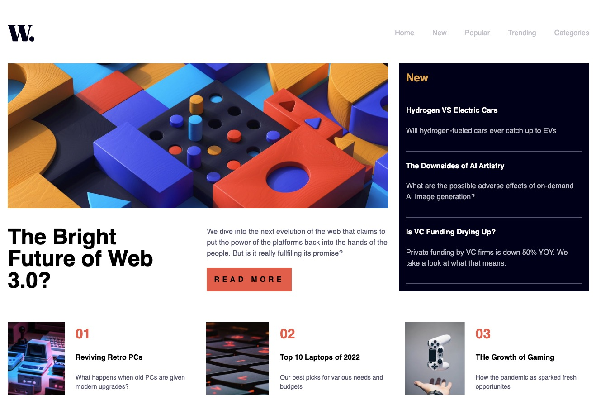

---

# 📰 Web 3.0 News Landing Page

A **responsive** news landing app built with **React** and **Tailwind CSS**.  
This application features a modern, mobile-first layout with dynamic headline, latest articles, and a ranked news section.

---

## 📸 Preview


LIVE: http://dzik0.github.io/news-homepage

---

## 🚀 Features

- 📱 **Responsive Layout** (Mobile/Desktop headers)
- 📰 **Headline Hero Section** with adaptive image
- 🆕 **Latest News** highlight
- 🏆 **Ranking Section** for top articles
- ⚛️ **React Functional Components**
- 🎨 **Styled with Tailwind CSS**
- 🖼️ **Optimized image assets for all screens**

---

## 🛠️ Tech Stack

- **React**
- **Tailwind CSS**
- **Vite** or **Create React App** (depending on your setup)

---

## 📁 File Structure

```
src/
│
├── components/
│   ├── HeaderMobile.jsx   # Mobile navigation/header
│   ├── HeaderPc.jsx       # Desktop navigation/header
│   ├── Hero.jsx           # Main headline with images
│   ├── New.jsx            # Latest articles section
│   └── Ranking.jsx        # Ranked news previews
│
├── assets/
│   ├── image-web-3-mobile.jpg
│   └── image-web-3-desktop.jpg
└── App.jsx
```

---

## 🧠 How It Works

- **Responsive grid** automatically switches between mobile and desktop headers
- **Hero section** adapts images and layout for screen sizes
- **Modern React structure** for quick customization and extension
- **Tailwind utilities** provide maintainable, scalable styling

---

## 📦 Installation

1. **Clone the repository**
   ```bash
   git clone https://github.com/dzik0/news-homepage.git
   ```
2. **Navigate to the project**
   ```bash
   cd web3-news-landing
   ```
3. **Install dependencies**
   ```bash
   npm install
   ```
4. **Start the development server**
   ```bash
   npm run dev
   ```

---

## ✅ Todo / Improvements

- [ ] Add dynamic news API integration
- [ ] Include article search/filter functionality
- [ ] Add accessibility improvements
- [ ] Add dark mode toggle

---

## 👨‍💻 Author

**Piotr Głazowski**  
[Portfolio](#) - [GitHub](https://github.com/dzik0)

---

## 📝 License

This project is open-source, available under the [MIT License](LICENSE).

---
